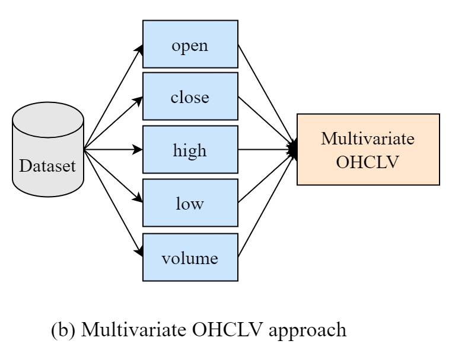

# A Novel Multivariate Bi-LSTM model for Short-Term Equity Price Forecasting

This repository contains the implementation and resources for the research paper "A Novel Multivariate Bi-LSTM model for Short-Term Equity Price Forecasting".

## Paper Abstract

Prediction models are crucial in the stock market as they aid in forecasting future prices and trends, enabling investors to make informed decisions and manage risks more effectively. In the Indian stock market, where volatility is often high, accurate predictions can provide a significant edge in capitalizing on market movements. While various models like regression and Artificial Neural Networks (ANNs) have been explored for this purpose, studies have shown that Long Short-Term Memory networks (LSTMs) are the most effective. This is because they can capture complex temporal dependencies present in financial data. This paper presents a Bidirectional Multivariate LSTM model designed to predict short-term stock prices of Indian companies in the NIFTY 100 across four major sectors- ICICI Bank, NTPC, Ambuja Cement and Wipro. The study utilizes eight years of hourly historical data, from 2015 to 2022, to perform a comprehensive analysis of the proposed methods. Both Univariate LSTM and Univariate Bidirectional LSTM models were evaluated based on R2 score, RMSE, MSE, MAE, and MAPE. To improve predictive accuracy, the analysis was extended to multivariate data. Additionally, 12 technical indicators, having high correlation values with the close price(greater than 0.99) including EMA5, SMA5, TRIMA5, KAMA10 and the Bollinger Bands were selected as variables to further optimize the prediction models. The proposed Bidirectional Multivariate LSTM model, when applied to a dataset containing these indicators, achieved an exceptionally high average R2 score of 99.4779% across the four stocks, which is 3.9833% higher than that of the Unidirectional Multivariate LSTM without technical indicators. The proposed model has an average RMSE of 0.0103955, an average MAE of 0.007485 and an average MAPE of 1.1635%. This highlights the model’s exceptional forecasting accuracy and emphasizes its potential to improve short-term trading strategies.

## Approaches

Our research evaluates different approaches to stock price prediction:

### 1. Univariate Approach

<div align="center">

</div>
<br>
<br>
In the univariate approach, we use only the closing price from the dataset to predict future stock prices. This simple method serves as our baseline for comparison.
<br>
<br>

### 2. Multivariate OHCLV Approach

<div align="center">

</div>
<br>
<br>
The multivariate OHCLV approach incorporates Open, High, Close, Low, and Volume data to provide more context for the prediction model, allowing it to capture more complex relationships in the market data.
<br>
<br>

### 3. Multivariate Technical Indicators Approach

<div align="center">

</div>
<br>
<br>
Our proposed Bidirectional LSTM approach incorporates the following technical indicators which have high correlation values (>0.99) with the close price, in addition to OHCLV metrics.
<br>
<br>
<div align="center">

</div>


## Citation

If you use this code or the findings in your research, please cite our paper:

```
O. Oak, R. Nazre, R. Budke and Y. Mahatekar, "A Novel Multivariate Bi-LSTM model for Short-Term Equity Price Forecasting," 2024 5th IEEE Global Conference for Advancement in Technology (GCAT), Bangalore, India, 2024, pp. 1-6, doi: 10.1109/GCAT62922.2024.10923989.
```
## Authors

[Omkar Oak](https://github.com/omkarsoak) $^1$, [Rukmini Nazre](https://github.com/rukmini-17) $^1$, [Rujuta Budke](https://github.com/rujuta13) $^1$, Yogita Mahatekar $^2$ <br>
$^1$ Department of Computer Science and Engineering, COEP Technological University <br>
$^2$ Department of Mathematics, COEP Technological University <br>
Pune, MH, India. <br>


## Contact

For any questions or inquiries about this research, please open an issue on this repository or contact the corresponding author.
